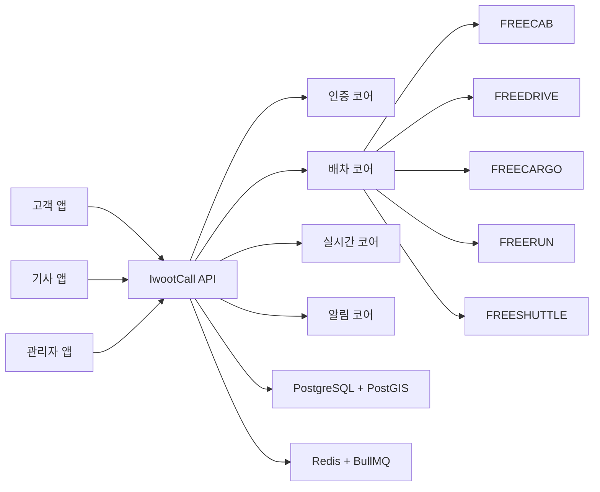

# IwootCall

이웃콜은 한국형 생활 이동 노동을 위한 무수수료 오픈소스 배차 플랫폼입니다.
택시, 대리, 화물, 퀵, 농어촌 셔틀처럼 서로 다른 이동 서비스를 하나의 공통 코어 위에서 운영할 수 있게 만드는 것이 목표입니다.

## 왜 만들었나요

기존 플랫폼은 배차망을 통제하면서 기사와 라이더에게 높은 수수료를 부과하는 경우가 많습니다.
이웃콜은 "배차 플랫폼 자체를 무료 오픈소스로 만들면, 지역 단위 서비스나 협동조합, 기사 중심 조직도 직접 운영할 수 있지 않을까?"라는 문제의식에서 출발했습니다.

핵심 방향은 아래와 같습니다.

- 배차 코어는 공유하고, 서비스 모듈은 분리합니다.
- 외부 지도 API에 과하게 의존하지 않고 자체 운영 가능한 구조를 우선합니다.
- 특정 기업의 폐쇄형 플랫폼이 아니라, 누구나 내려받아 실행하고 확장할 수 있는 기반을 지향합니다.

## 이 저장소에 들어 있는 것

현재 저장소는 `이웃콜 Phase 0` 기준의 백엔드 코어와 로컬 데모 UI를 포함합니다.

- `pnpm` 모노레포 + Turborepo
- Fastify API
- PostgreSQL + PostGIS + Prisma
- Redis + BullMQ 배차 큐
- Socket.IO 실시간 이벤트
- 고객 앱, 기사 앱, 관리자 앱
- FreeCab / FreeDrive / FreeCargo / FreeRun / FreeShuttle 모듈 기반

즉, "서비스 소개 페이지"가 아니라 "실제로 로컬에서 띄워 보고 구조를 이해할 수 있는 개발용 기반 저장소"에 가깝습니다.

## 처음 보는 분은 이렇게 읽으면 됩니다

1. 프로젝트가 왜 만들어졌는지와 전체 개념부터 이해하려면 [서비스 개요 문서](./docs/guides/SERVICE_OVERVIEW_KO.md)를 보세요.
2. 바로 실행해 보고 싶다면 [초보자 실행 가이드](./docs/guides/BEGINNER_GUIDE_KO.md)를 보세요.
3. GitHub에 공개 업로드하거나 배포 전에 점검하려면 [GitHub 공개배포 가이드](./docs/guides/GITHUB_PUBLISHING_KO.md)를 보세요.

## 핵심 개념

이웃콜은 아래 다섯 개념으로 이해하면 쉽습니다.

- `Customer`: 호출을 만드는 사용자
- `Worker`: 호출을 수락하고 수행하는 기사/라이더/운전자
- `Job`: 실제 배차 대상이 되는 호출 단위
- `Module`: 택시/대리/화물/퀵/셔틀처럼 서비스 종류를 구분하는 단위
- `Core`: 인증, 배차, 실시간, 알림처럼 모듈이 공통으로 쓰는 기반 기능

## 개념도



## 가장 빠른 실행 순서

```powershell
Copy-Item .env.example .env
pnpm install
pnpm dev:stack
pnpm dev:start
pnpm smoke:local
```

실행 후 접속 주소는 아래와 같습니다.

- 고객 앱: `http://localhost:3101`
- 기사 앱: `http://localhost:3102`
- 관리자 앱: `http://localhost:3103`
- API 상태 확인: `http://localhost:3001/health`

## 자주 쓰는 명령

- `pnpm test`
- `pnpm build`
- `pnpm typecheck`
- `pnpm dev:stack`
- `pnpm dev:stack:down`
- `pnpm dev:start`
- `pnpm smoke:local`
- `pnpm dev:stop`
- `pnpm clean:local`
- `pnpm publish:check`

## 현재 구현 범위

현재 기준으로 아래 범위까지 구현되어 있습니다.

- 고객/기사 인증과 개발용 OTP 로그인
- 관리자 워커 관리와 통계 조회
- 고객 차량, 즐겨찾기, 프로필 관리
- 기사 프로필, 온라인 상태, 활성 작업, 수익 조회
- 모듈별 잡 생성과 배차 큐 처리
- 실시간 위치/배차 이벤트
- 알림 provider 추상화와 개발용 fallback
- 로컬 Docker 기반 실행 스택

아직 남아 있는 대표 항목은 아래와 같습니다.

- 운영용 FCM/SMS 실연동 최종 설정
- 실제 운영 배포 인프라 고도화
- 서비스 운영 정책과 디자인 고도화

## 로컬 실행 시 알아둘 점

- `pnpm dev:start`는 PostgreSQL 또는 Redis가 없으면 바로 멈추고 `pnpm dev:stack`을 먼저 실행하라고 알려줍니다.
- `pnpm smoke:local`도 같은 사전 점검을 하고, 준비가 안 된 상태에서 무작정 API를 두드리지 않습니다.
- `pnpm clean:local`은 `output`, `.turbo`, 앱의 `.next`, 빌드 산출물처럼 로컬 전용 파일을 정리합니다.
- 런타임 로그는 `output/runtime` 아래에 저장됩니다.

## 공개 업로드 주의사항

- `.env`, 키, 토큰, 인증 파일은 GitHub에 올리면 안 됩니다.
- 개인 정보나 민감 정보는 프로젝트 폴더가 아니라 `C:\Users\sinmb\key` 아래에 두는 것이 안전합니다.
- 공개 전에는 반드시 `pnpm publish:check`를 실행하세요.
