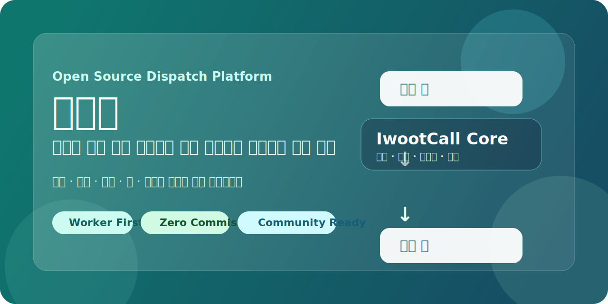
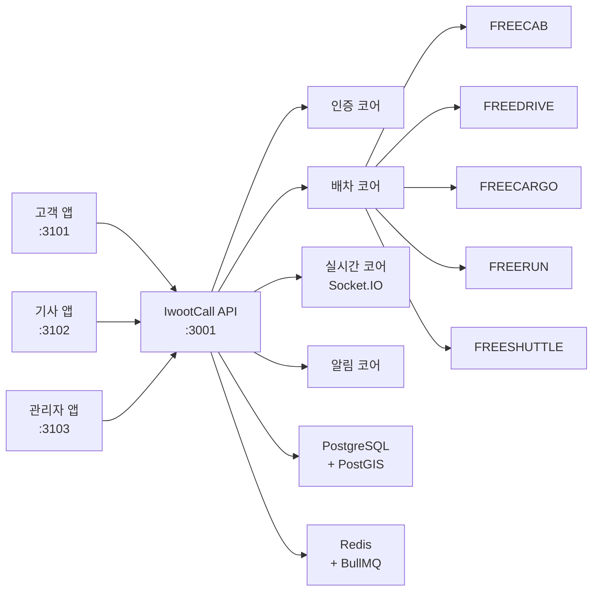
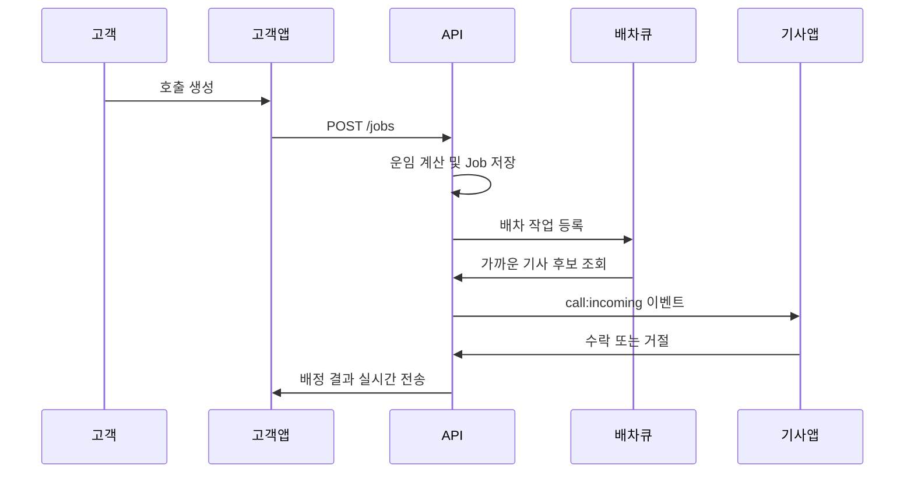

# IwootCall (이웃콜)

> **한국형 생활 이동 서비스를 위한 무수수료 오픈소스 배차 플랫폼**

택시, 대리운전, 화물, 퀵서비스, 농어촌 셔틀을 하나의 공통 배차 코어 위에서 운영할 수 있게 설계된 플랫폼입니다.
지역 서비스, 협동조합, 기사 중심 조직이 외부 플랫폼 수수료 없이 직접 배차 시스템을 운영하는 것을 목표로 합니다.



---

## 왜 만들었나요

기존 배차 플랫폼은 호출을 연결해 주는 대가로 높은 수수료를 부과하고, 기사와 운전자를 플랫폼에 종속시킵니다.

이웃콜은 "배차 시스템 자체를 오픈소스로 공개하면, 지역 단위 서비스나 협동조합도 독립적으로 운영할 수 있지 않을까?"라는 질문에서 시작했습니다.

- 배차 코어는 공유하고, 서비스 모듈은 분리합니다.
- 외부 지도 API에 과도하게 의존하지 않는 자체 운영 가능한 구조를 우선합니다.
- 누구나 내려받아 실행하고 확장할 수 있는 기반을 지향합니다.

---

## 핵심 개념

이웃콜은 아래 5가지 개념으로 이해하면 구조가 바로 보입니다.

| 개념 | 설명 |
|------|------|
| `Customer` | 호출을 만드는 사람 (고객) |
| `Worker` | 호출을 수락하고 수행하는 사람 (기사·라이더·운전자) |
| `Job` | 배차의 기본 단위 — 택시 호출도, 화물 요청도 모두 `Job` |
| `Module` | 서비스 종류를 구분하는 단위 (FREECAB, FREEDRIVE 등) |
| `Core` | 인증·배차·실시간·알림처럼 모든 모듈이 공통으로 쓰는 기반 |

### 서비스 모듈

| 모듈 | 서비스 | 요금 방식 |
|------|--------|----------|
| `FREECAB` | 택시 호출 | 미터제 |
| `FREEDRIVE` | 대리운전 | 구역제 |
| `FREECARGO` | 화물·용달·짐 운송 | 거리제 |
| `FREERUN` | 퀵·심부름·다중 경유 | 거리제 |
| `FREESHUTTLE` | 농어촌형 호출 셔틀 | 고정 요금 |

---

## 시스템 구조



핵심은 **"모듈은 여러 개지만 코어는 하나"** 입니다.
서비스 종류가 늘어나도 배차 엔진을 매번 새로 만들지 않고, 모듈별 규칙만 추가합니다.

---

## 배차 흐름



---

## 빠른 시작

### 준비물

- Node.js 20+
- pnpm 9+
- Docker Desktop

```powershell
node -v        # v20 이상
pnpm -v        # 9 이상
docker -v
```

### 실행 순서

```powershell
# 1. 환경 변수 파일 준비
Copy-Item .env.example .env

# 2. 패키지 설치
pnpm install

# 3. PostgreSQL, Redis 시작 (Docker)
pnpm dev:stack

# 4. API + 앱 3개 시작
pnpm dev:start

# 5. 자동 동작 확인 (선택)
pnpm smoke:local
```

### 접속 주소

| 앱 | 주소 | 설명 |
|----|------|------|
| 고객 앱 | http://localhost:3101 | 호출을 만드는 화면 |
| 기사 앱 | http://localhost:3102 | 호출을 수락하는 화면 |
| 관리자 앱 | http://localhost:3103 | 전체 운영 상태 |
| API | http://localhost:3001/health | 서버 상태 확인 |

> **개발 모드 OTP**: 항상 `000000`

---

## 처음 체험 순서 (5분)

1. **관리자 앱** (`localhost:3103`) → `Generate local dev token` 클릭
2. **기사 앱** (`localhost:3102`) → OTP `000000`으로 로그인 → 온라인 상태 켜기
3. **고객 앱** (`localhost:3101`) → OTP `000000`으로 로그인 → `FreeCab` 호출 생성
4. **기사 앱**에서 배차 이벤트 확인 후 수락
5. **관리자 앱**에서 기사 상태·잡 상태가 실시간으로 바뀌는지 확인

이 흐름 한 번이면 "여러 앱이 하나의 배차 코어를 공유하는 구조"가 바로 보입니다.

---

## 주요 명령어

```powershell
pnpm dev:stack          # Docker DB/Redis 시작
pnpm dev:start          # API + 앱 3개 시작
pnpm smoke:local        # 동작 자동 확인
pnpm dev:stop           # 앱 종료
pnpm dev:stack:down     # DB 컨테이너까지 종료
pnpm clean:local        # 로컬 산출물 정리

pnpm test               # 전체 테스트
pnpm build              # 전체 빌드
pnpm typecheck          # 타입 검사
pnpm publish:check      # 공개 업로드 전 사전 점검
```

---

## 현재 구현 범위 (Phase 0)

**완료된 기능:**
- 고객·기사 OTP 인증 (JWT)
- 관리자 워커 관리·통계 조회
- 고객 차량·즐겨찾기·프로필 관리
- 기사 프로필·온라인 상태·활성 작업·수익 조회
- 모듈별 잡 생성·배차 큐 처리 (BullMQ)
- Socket.IO 실시간 위치·배차 이벤트
- 로컬 Docker 기반 실행 스택 (PostgreSQL + PostGIS + Redis)

**앞으로 남은 것:**
- 운영용 FCM/SMS 실연동 최종 설정
- 실 운영 배포 인프라 고도화
- 서비스별 정책·요금·운영 룰 세분화
- 디자인 시스템·사용자 경험 개선

---

## 로컬 실행 시 알아둘 점

- `pnpm dev:start`는 PostgreSQL·Redis가 없으면 즉시 멈추고 `pnpm dev:stack`을 먼저 실행하라고 알려줍니다.
- `pnpm smoke:local`도 같은 사전 점검 후 진행합니다.
- 런타임 로그는 `output/runtime` 에 저장됩니다.
- `pnpm clean:local`은 `output`, `.turbo`, `.next`, `dist` 등 로컬 전용 파일을 정리합니다.

---

## 공개 업로드 주의사항

- `.env`, API 키, 인증 파일은 절대 GitHub에 올리지 마세요.
- 공개 전 반드시 `pnpm publish:check`를 실행하세요.
- 민감 파일은 프로젝트 폴더 외부에 보관하세요.

---

## 문서

| 문서 | 설명 |
|------|------|
| [서비스 개요](./docs/guides/SERVICE_OVERVIEW_KO.md) | 프로젝트 취지·구조·동작 흐름 |
| [비개발자 소개서](./docs/guides/NON_DEVELOPER_OVERVIEW_KO.md) | 개발 지식 없이 읽는 소개서 |
| [초보자 실행 가이드](./docs/guides/BEGINNER_GUIDE_KO.md) | 단계별 로컬 실행 가이드 |
| [GitHub 공개배포 가이드](./docs/guides/GITHUB_PUBLISHING_KO.md) | 안전한 공개 업로드 절차 |

---

## 라이선스

[MIT License](LICENSE) — Copyright 22B Labs 2026
