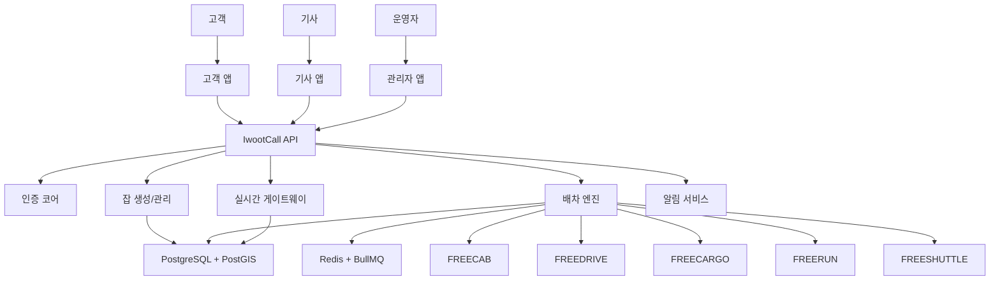
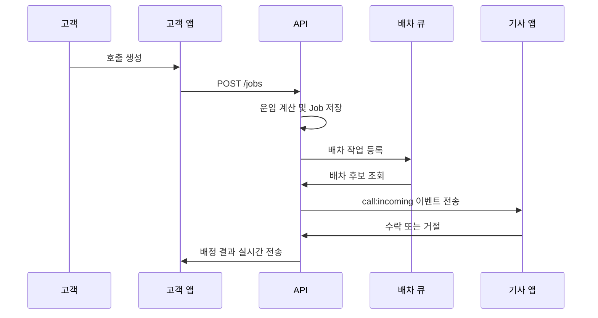

# 이웃콜 서비스 개요

이 문서는 이웃콜을 처음 접하는 사람이 "이 프로젝트가 왜 있는지", "무엇을 하려는지", "어떤 구조로 돌아가는지"를 빠르게 이해할 수 있도록 만든 한글 소개서입니다.

## 1. 한 문장으로 설명하면

이웃콜은 택시, 대리, 화물, 퀵, 셔틀 같은 생활 이동 서비스를 하나의 공통 코어로 운영할 수 있게 만드는 무수수료 오픈소스 배차 플랫폼입니다.

## 2. 왜 만들었나요

이웃콜은 단순히 앱을 하나 더 만드는 프로젝트가 아닙니다.
배차를 통제하는 플랫폼이 노동자에게 과도한 수수료와 종속 구조를 만드는 문제를 기술적으로 완화해 보려는 시도입니다.

이 프로젝트가 지향하는 방향은 아래와 같습니다.

- 배차 플랫폼을 무료로 공개해 누구나 직접 운영할 수 있게 합니다.
- 기사, 라이더, 운전자가 플랫폼에 과도하게 종속되지 않도록 합니다.
- 지역 기반 서비스, 협동조합, 소규모 사업자도 자체 배차 시스템을 가질 수 있게 합니다.
- 모듈별 서비스는 다르더라도 인증, 배차, 실시간, 알림 같은 공통 기능은 재사용합니다.

## 3. 누구를 위한 프로젝트인가요

이웃콜은 아래 같은 사람이나 조직을 염두에 두고 설계되었습니다.

- 지역 택시/대리/퀵 네트워크를 직접 운영하고 싶은 팀
- 기사 중심 협동조합이나 조합형 플랫폼을 만들고 싶은 조직
- 공공형 이동 서비스나 농어촌 호출형 셔틀을 실험하고 싶은 팀
- 한국형 배차 시스템 구조를 공부하고 싶은 개발자

## 4. 핵심 개념

처음에는 기능이 많아 보여도, 실제로는 아래 개념만 잡으면 구조가 보이기 시작합니다.

### Customer

호출을 만드는 사람입니다.
출발지와 도착지를 입력하고, 원하는 서비스 모듈을 선택해 `Job`을 생성합니다.

### Worker

호출을 받아 실제로 일을 수행하는 사람입니다.
택시 기사, 대리 기사, 퀵 기사, 화물 기사, 셔틀 운행자 등을 모두 공통 개념인 `Worker`로 다룹니다.

### Job

배차의 중심이 되는 작업 단위입니다.
택시 호출도 `Job`, 대리 호출도 `Job`, 화물 요청도 `Job`으로 관리됩니다.

### Module

서비스 종류를 구분하는 단위입니다.
이웃콜은 현재 아래 5개 모듈을 전제로 합니다.

- `FREECAB`: 택시형 호출
- `FREEDRIVE`: 대리운전
- `FREECARGO`: 화물/용달/짐 운송
- `FREERUN`: 퀵/심부름/다중 경유형 배달
- `FREESHUTTLE`: 농어촌형 호출 셔틀

### Core

모듈과 상관없이 공통으로 쓰는 기반 기능입니다.
예를 들면 인증, 배차, 실시간 위치, 알림, 관리자 기능이 여기에 들어갑니다.

## 5. 구조를 한눈에 보면

이 구조의 핵심은 "모듈은 여러 개지만 코어는 하나"라는 점입니다.
서비스 종류가 늘어나도 배차 엔진을 매번 새로 만들지 않고, 모듈별 규칙만 확장하는 방향을 택했습니다.

## 6. 실제 동작 흐름

아래 흐름으로 생각하면 가장 쉽습니다.

즉, 이웃콜은 "버튼을 누르면 바로 기사에게 전화가 가는 앱"이 아니라,
`호출 생성 -> 후보 탐색 -> 배차 -> 실시간 상태 공유`라는 흐름을 공통 코어로 다루는 플랫폼입니다.

## 7. 이 저장소에서 지금 바로 해볼 수 있는 것

현재 저장소는 개념 문서만 있는 상태가 아니라, 실제 로컬 실행이 가능한 개발 기반을 포함합니다.

- 고객 앱에서 회원가입/로그인
- 기사 앱에서 로그인 후 온라인 상태 전환
- 관리자 앱에서 워커 상태와 통계 확인
- 고객이 호출 생성
- 기사에게 배차 이벤트 전달
- 관리자/고객/기사 화면에서 상태 확인

즉, "구조 설명용 설계서"이면서 동시에 "로컬에서 체험 가능한 프로토타입 저장소"라고 이해하면 됩니다.

## 8. 첫 사용자는 무엇부터 보면 되나요

처음 접하는 분에게는 아래 순서를 추천합니다.

1. 이 문서를 읽고 프로젝트 취지와 구조를 이해합니다.
2. [초보자 실행 가이드](./BEGINNER_GUIDE_KO.md)대로 로컬 실행을 합니다.
3. 고객 앱, 기사 앱, 관리자 앱을 각각 열어 역할별 흐름을 봅니다.
4. 그다음 루트 [README](../../README.md)에서 자주 쓰는 명령과 현재 구현 범위를 확인합니다.

## 9. 첫 체험은 이렇게 해보면 쉽습니다

가장 이해가 빠른 체험 순서는 아래와 같습니다.

1. 고객 앱에서 회원가입 또는 로그인
2. 기사 앱에서 로그인하고 온라인 상태로 변경
3. 관리자 앱에서 기사 상태가 반영되는지 확인
4. 고객 앱에서 `FreeCab` 또는 `FreeRun` 호출 생성
5. 기사 앱에서 배차 수락
6. 고객/기사/관리자 화면에서 상태가 함께 바뀌는지 확인

이 과정을 한번 보면 "이웃콜이 단순한 예약 폼이 아니라 배차 플랫폼"이라는 점이 바로 보입니다.

## 10. 이 프로젝트가 아직 하지 않은 것

Phase 0 기준으로는 코어와 로컬 실행 기반에 집중되어 있습니다.
아래 항목은 후속 단계에서 더 발전할 수 있습니다.

- 운영용 푸시/SMS 실서비스 연동 정교화
- 실제 프로덕션 인프라와 모니터링 확장
- 고도화된 디자인 시스템과 사용자 경험
- 지역별 정책, 요금, 운영 룰 세분화

## 11. 한 줄 요약

이웃콜은 "한국형 생활 이동 서비스를 위한 공통 배차 코어를 오픈소스로 만들고, 누구나 직접 운영 가능한 형태로 제공하자"는 목표를 가진 프로젝트입니다.
