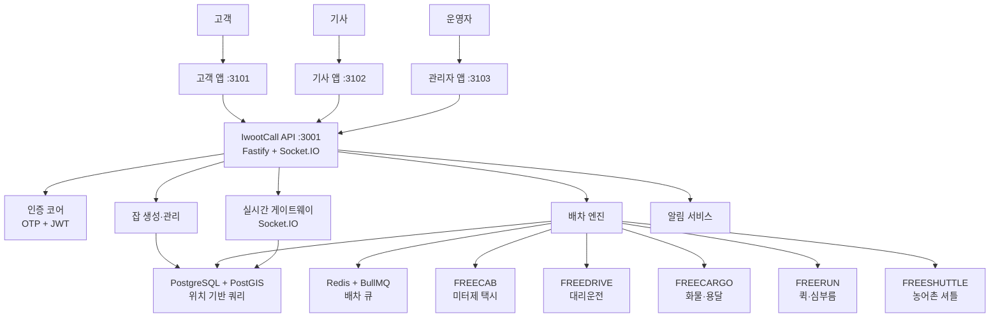
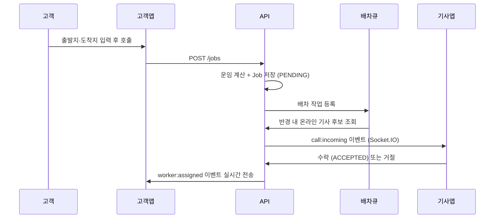

# 이웃콜 서비스 개요

이 문서는 이웃콜이 **왜 만들어졌는지**, **무엇을 하는지**, **어떤 구조로 동작하는지**를 처음 접하는 사람도 빠르게 이해할 수 있도록 정리한 문서입니다.

---

## 1. 한 문장 요약

> **이웃콜은 택시·대리·화물·퀵·셔틀 같은 생활 이동 서비스를 하나의 공통 배차 코어로 운영할 수 있게 만드는 무수수료 오픈소스 플랫폼입니다.**

---

## 2. 왜 만들었나요

배차 플랫폼의 구조적 문제는 단순합니다.
플랫폼이 호출을 중간에서 연결해 주고, 그 대가로 기사와 운전자에게 높은 수수료를 요구합니다.
기사는 플랫폼에 의존하지 않으면 일을 받을 수 없고, 플랫폼은 그 의존성을 유지하려 합니다.

이웃콜은 이 문제를 기술적으로 완화하려는 시도입니다.

| 기존 구조 | 이웃콜의 방향 |
|----------|------------|
| 플랫폼이 배차망 독점 | 배차 코어 오픈소스 공개 |
| 높은 수수료 의존 | 무수수료 자체 운영 가능 |
| 중앙집중형 운영 | 지역·협동조합 단위 독립 운영 |
| 외부 지도 API 종속 | OSM 기반 자체 지도 운영 가능 |

---

## 3. 누구를 위한 프로젝트인가요

- 지역 택시·대리·퀵 네트워크를 직접 운영하고 싶은 팀
- 기사 중심 협동조합이나 조합형 플랫폼을 만들고 싶은 조직
- 공공형 이동 서비스나 농어촌 호출형 셔틀을 실험하는 팀
- 한국형 배차 시스템 구조를 공부하고 싶은 개발자

---

## 4. 핵심 개념 5가지

기능이 많아 보여도, 아래 5개 개념만 잡으면 전체 구조가 보입니다.

### Customer (고객)

호출을 만드는 사람입니다.
출발지와 도착지를 입력하고, 원하는 서비스 모듈(택시, 대리 등)을 선택해 `Job`을 생성합니다.

### Worker (기사·운전자)

호출을 받아 실제로 일을 수행하는 사람입니다.
택시 기사, 대리 기사, 퀵 기사, 화물 기사, 셔틀 운행자를 모두 `Worker`라는 하나의 개념으로 다룹니다.

### Job (작업 단위)

배차의 중심이 되는 단위입니다.
택시 호출도 `Job`, 대리 호출도 `Job`, 화물 요청도 `Job`입니다.
하나의 Job은 아래 상태를 거칩니다.

```
PENDING → DISPATCHED → ACCEPTED → ARRIVED → IN_PROGRESS → COMPLETED
                                                    ↘ CANCELLED / NO_WORKER
```

### Module (서비스 종류)

이웃콜이 지원하는 서비스 종류를 구분하는 단위입니다.

| 모듈 | 서비스 | 요금 방식 | 차량 유형 |
|------|--------|----------|----------|
| `FREECAB` | 택시 호출 | 미터제 | 세단, 밴 |
| `FREEDRIVE` | 대리운전 | 구역제 | 모든 차량 |
| `FREECARGO` | 화물·용달 | 거리제 | 상용차 (세금계산서 필요) |
| `FREERUN` | 퀵·심부름 | 거리제 | 오토바이, 자전거 |
| `FREESHUTTLE` | 농어촌 셔틀 | 고정 요금 | 모든 차량 |

### Core (공통 기반)

모듈과 상관없이 모든 서비스가 함께 쓰는 기반 기능입니다.

- **인증 코어**: OTP 로그인, JWT 토큰 발급·검증
- **배차 코어**: 가까운 기사 탐색, 배차 큐 처리
- **실시간 코어**: Socket.IO로 위치·이벤트 실시간 공유
- **알림 코어**: FCM 푸시·SMS 알림 (운영 환경)
- **관리자 코어**: 워커 관리, 통계, 셔틀 노선 설정

---

## 5. 시스템 구조



**핵심:** 모듈은 여러 개지만 코어는 하나입니다.
서비스 종류가 늘어나도 배차 엔진을 처음부터 다시 만들지 않고, 모듈별 규칙만 추가합니다.

---

## 6. 실제 배차 흐름



이웃콜은 "버튼을 누르면 기사에게 전화가 가는 앱"이 아닙니다.
`호출 생성 → 후보 탐색 → 배차 큐 처리 → 실시간 상태 공유`라는 흐름 전체를 공통 코어로 처리합니다.

---

## 7. 기술 스택

| 영역 | 기술 |
|------|------|
| 백엔드 API | Fastify 5, TypeScript 5, Node.js 20 |
| 데이터베이스 | PostgreSQL 16 + PostGIS (위치 기반 쿼리) |
| ORM | Prisma 5 |
| 큐 시스템 | Redis 7 + BullMQ (배차 큐) |
| 실시간 통신 | Socket.IO 4 |
| 인증 | JWT (jose), OTP |
| 푸시 알림 | Firebase Admin SDK |
| 프론트엔드 | Next.js 16, React 19 (앱 3개) |
| 모노레포 | pnpm + Turborepo |
| 지도·라우팅 | OSM + OSRM (자체 운영 가능) |
| 컨테이너 | Docker Compose |

---

## 8. 지금 로컬에서 할 수 있는 것

이 저장소는 개념 설명만 있는 문서 저장소가 아닙니다.
**로컬에서 직접 실행하고 배차 흐름을 체험할 수 있는 개발 기반**이 포함되어 있습니다.

- 고객 앱에서 회원가입·로그인·호출 생성
- 기사 앱에서 로그인·온라인 상태 전환·배차 수락
- 관리자 앱에서 워커 상태·통계 확인
- 고객·기사·관리자 화면에서 상태가 실시간으로 바뀌는 것 확인

실행 방법은 [초보자 실행 가이드](./BEGINNER_GUIDE_KO.md)를 참고하세요.

---

## 9. Phase 0 이후 계획

현재는 코어와 로컬 실행 기반에 집중되어 있습니다.
아래는 후속 단계에서 발전할 수 있는 항목입니다.

- 운영용 FCM·SMS 실서비스 연동 정교화
- 실제 프로덕션 인프라·모니터링 확장
- 서비스별 정책·요금·운영 룰 세분화
- 고도화된 디자인 시스템·사용자 경험

---

## 10. 한 줄 정리

> **이웃콜은 한국형 생활 이동 서비스를 위한 공통 배차 코어를 오픈소스로 만들고, 누구나 직접 운영 가능한 형태로 제공하려는 프로젝트입니다.**
